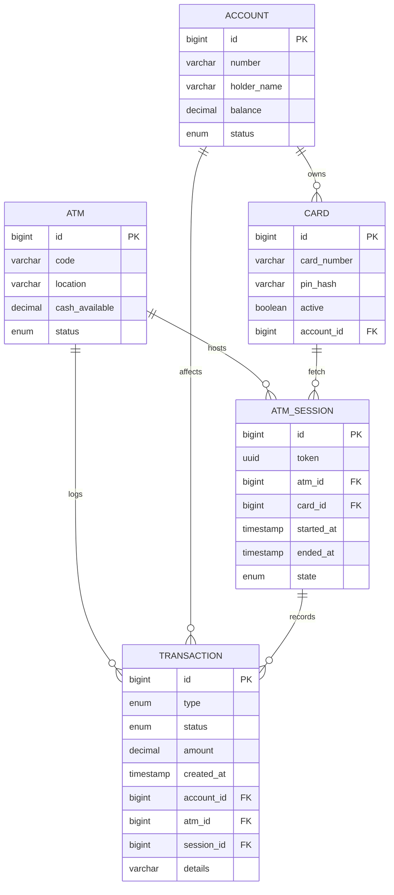

# ATM – Spring Boot Edition

This module modernizes the `atm` LLD into a Spring Boot REST API that models cards, accounts, cash inventory, ATM sessions, and transactions. It runs on H2 in-memory storage for quick end-to-end simulation.

## Domain Schema

## What’s Included
- Spring Boot 3, JPA, H2 for persisting accounts, cards, ATMs, sessions, and transactions.
- REST endpoints for session-based auth (card + PIN), balance inquiry, withdrawal, deposit, and session end.
- MapStruct DTO mapping, validation on inputs, and sample data for quick experiments.
- HTTP request samples (`requests.http`) and a Spring Boot test covering happy-path flows (auth → withdraw/deposit → end session).

## Run & Explore
1. `cd solutions/java/springboot/atm`
2. `mvn spring-boot:run`
3. Use `requests.http` to drive the flows or open `http://localhost:8080/h2-console` (JDBC `jdbc:h2:mem:atmdb`) to inspect state.

## API Preview
- `POST /api/atm/sessions` – authenticate card/PIN, start a session.
- `POST /api/atm/sessions/{sessionId}/balance` – check balance.
- `POST /api/atm/sessions/{sessionId}/withdraw` – withdraw cash (checks account + ATM cash).
- `POST /api/atm/sessions/{sessionId}/deposit` – deposit cash.
- `POST /api/atm/sessions/{sessionId}/end` – close the session.

All requests use JSON; DTO contracts live under `dto/`.

## Testing
`mvn test` runs the Spring Boot service test to verify a full session (auth → withdraw → deposit → end) against the in-memory database.
