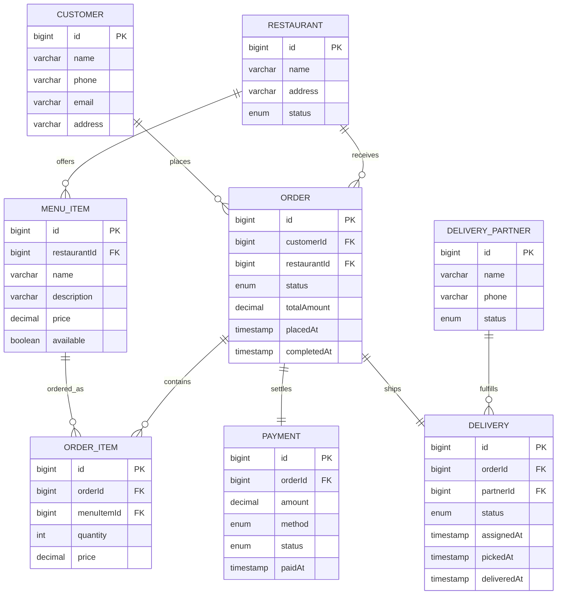

# Food Delivery Service – Spring Boot Edition

This module reimagines the `fooddeliveryservice` LLD as a Spring Boot backend. It models customers, restaurants, menu items, orders, delivery partners, payments, and deliveries with an H2-backed schema ready for REST APIs.

## Domain Schema

## What’s Planned
- Spring Boot 3 + JPA + H2 for an in-memory backend.
- REST endpoints to browse restaurants/menus, place orders, pay, assign delivery partners, and track delivery status.
- DTO records, validation, and MapStruct mapping.
- Seed data and HTTP scratch file for quick manual testing.

## Run & Explore (once implemented)
1. `cd solutions/java/springboot/fooddeliveryservice`
2. `mvn spring-boot:run`
3. Use `requests.http` to exercise the APIs or open `http://localhost:8080/h2-console` (JDBC `jdbc:h2:mem:fooddb`) to inspect data.
