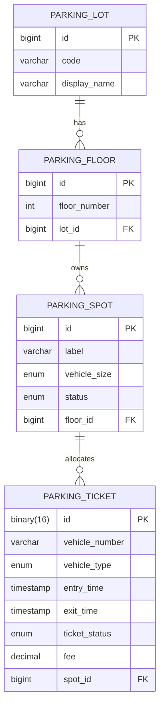

# Parking Lot – Spring Boot Edition

This module re-imagines the `parkinglot` LLD using a production-ready Spring Boot stack. The service exposes REST APIs for parking/unparking vehicles, keeps track of tickets, and persists data in an in-memory H2 database so you can run the LLD end-to-end within minutes.

## Tech Stack
- Spring Boot 3 (Web + Data JPA + Validation)
- MapStruct for DTO ↔ entity mapping and Java records for DTOs
- H2 in-memory database with automatic schema/data bootstrap
- Maven build + Spring Boot tests

## Project Layout
```
springboot/parkinglot
├── pom.xml
├── requests.http                  # ready-to-run HTTP samples
├── src/main/java/com/awesomelld/parkinglot
│   ├── controller                 # REST API surface
│   ├── dto                        # Java record based contracts
│   ├── entity / repository        # JPA entities & repositories
│   ├── service                    # ParkingLotService orchestration
│   └── support / mapper / enums   # Fee calculator, MapStruct mappers, enums
└── src/main/resources
    ├── application.yml            # H2 + logging configuration
    └── data.sql                   # Sample lot/floor/spot bootstrap data
```

## Domain Schema


## Run & Test
1. `cd solutions/java/springboot/parkinglot`
2. `mvn spring-boot:run`
3. Hit the APIs (examples below) or open `http://localhost:8080/h2-console` with JDBC URL `jdbc:h2:mem:parkinglotdb`.

Automated verification: `mvn test` executes `ParkingLotServiceTest`, which parks and releases vehicles through the service layer.

### API Quickstart (cURL)
```bash
# List parking lots + floors/spots
curl http://localhost:8080/api/parking-lots

# Check spot availability for CITY_CENTER
curl http://localhost:8080/api/parking-lots/CITY_CENTER/spots

# Park a car
curl -X POST http://localhost:8080/api/parking-lots/CITY_CENTER/tickets \
     -H "Content-Type: application/json" \
     -d '{"vehicleNumber":"KA-01-HH-1234","vehicleType":"CAR"}'

# Replace ${TICKET_ID} with the response ticketId to see the ticket
curl http://localhost:8080/api/parking-lots/CITY_CENTER/tickets/${TICKET_ID}

# Checkout the vehicle
curl -X PATCH http://localhost:8080/api/parking-lots/CITY_CENTER/tickets/${TICKET_ID}/checkout
```

You can also use the pre-built IntelliJ/VSCode HTTP file at `requests.http` for an even faster manual test loop.
