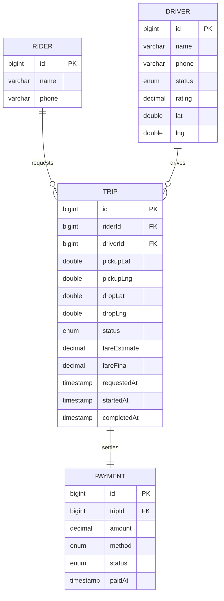

# Ride Sharing Service - Spring Boot Edition

This module reimagines the `ridesharingservice` LLD as a Spring Boot backend. It models riders, drivers, trips, locations, and payments with an H2-backed schema and REST-friendly contracts.

## Domain Schema

## What’s Included Now
- Spring Boot 3 + JPA + H2 in-memory backend.
- REST endpoints: request trip, view trip, start, complete, and pay.
- Driver auto-assignment to the nearest available driver; simple fare estimation.
- DTO records, validation, MapStruct mapping.
- Seed data (`data.sql`) and HTTP scratch file (`requests.http`) for manual testing.

## Run & Explore
1. `cd solutions/java/springboot/ridesharingservice`
2. `mvn spring-boot:run`
3. Use `requests.http` to exercise the APIs or open `http://localhost:8080/h2-console` (JDBC `jdbc:h2:mem:ridesharingdb`) to inspect data.

## API Overview
- `POST /api/rides` — create/request a trip (auto-assigns nearest available driver if any).
- `GET /api/rides/{tripId}` — fetch trip details.
- `POST /api/rides/{tripId}/start` — mark trip as ongoing (requires ACCEPTED).
- `POST /api/rides/{tripId}/complete` — finish trip and set final fare.
- `POST /api/rides/payments` — pay for a completed trip.

## Testing
`mvn test` runs `RideShareServiceTest` (request → start → complete → pay) against the in-memory database.
