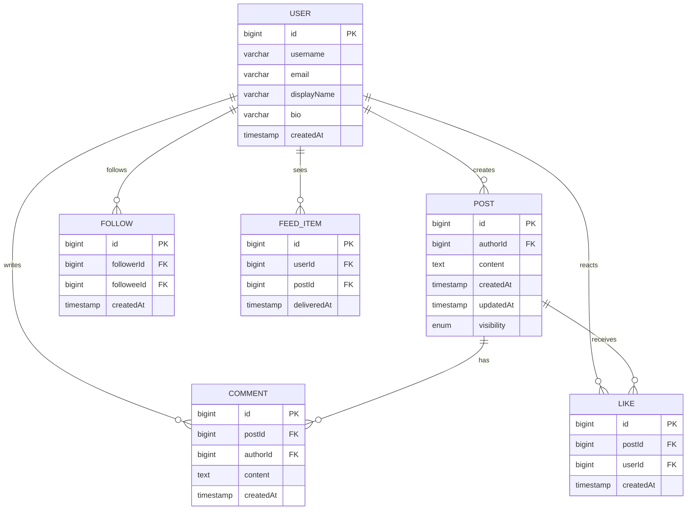

# Social Networking Service - Spring Boot Edition

Spring Boot implementation of the `socialnetworkingservice` LLD with users, posts, comments, likes, follows, and feeds backed by an in-memory H2 database.

## Domain Schema

## Stack and Features
- Spring Boot 3, Java 21, MapStruct, Lombok, Validation starter.
- H2 in-memory database with console at `/h2-console` (JDBC `jdbc:h2:mem:socialdb`).
- DTOs implemented as Java records with validation and MapStruct mapping.
- REST APIs: users, follows, posts, likes, comments, and feed.
- Seed data via `data.sql` plus HTTP scratchpad at `requests.http` for quick manual checks.

## Run and Explore
1. `cd solutions/java/springboot/socialnetworkingservice`
2. `mvn spring-boot:run`
3. Hit the APIs (see below) or open the H2 console to inspect tables.

## API Cheatsheet
- `GET /api/social/users` - list users.
- `POST /api/social/users` - create a user (JSON: `username`, `email`, `displayName`, optional `bio`).
- `POST /api/social/follows` / `DELETE /api/social/follows` - follow or unfollow (JSON: `followerId`, `followeeId`).
- `POST /api/social/posts` - create post.
- `GET /api/social/posts/{id}` - get post with like count.
- `POST /api/social/posts/{id}/likes?userId=` / `DELETE /api/social/posts/{id}/likes?userId=` - like or unlike a post.
- `POST /api/social/comments` - add comment.
- `GET /api/social/feed?userId=` - fetch feed sorted by delivery time.

## Testing
- `requests.http` contains ready-to-run HTTP examples compatible with IntelliJ/VS Code REST clients.
- `mvn test` runs `SocialServiceTest` against the in-memory database (creates post, likes, comments, fetches feed).
