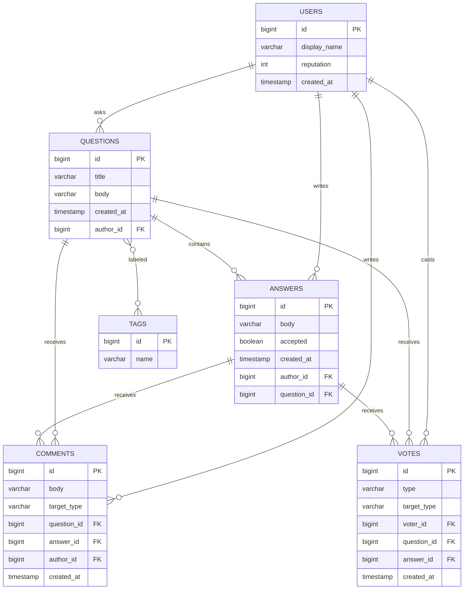

# StackOverflow – Spring Boot Edition

This module modernizes the classic StackOverflow LLD by wrapping it in a clean Spring Boot REST API with JPA persistence, H2 database seeding, and DTO/record-based contracts. It mirrors the same concepts as the `solutions/java/src/stackoverflow` package (questions, answers, votes, comments, tags, and reputation) but is now runnable end to end.

## Highlights
- Spring Boot 3 + JPA + H2 for an in-memory data store that refreshes on every run.
- MapStruct and Java records for type-safe DTO ↔ entity mappings.
- Reputation updates built into the service layer for votes and accepted answers.
- Ready-made HTTP request samples (`requests.http`) and service-level integration test.

## Structure
```
springboot/stackoverflow
├── pom.xml
├── requests.http
├── src/main/java/com/awesomelld/stackoverflow
│   ├── controller/StackOverflowController.java
│   ├── dto/… (request/response records)
│   ├── entity/… (User, Question, Answer, Tag, Comment, Vote)
│   ├── repository/… (Spring Data JPA)
│   ├── service/StackOverflowService.java
│   └── support/ReputationPolicy.java
├── src/main/resources/application.yml
└── src/main/resources/data.sql
```

## Schema Snapshot


## Run & Explore
1. `cd solutions/java/springboot/stackoverflow`
2. `mvn spring-boot:run`
3. Use `requests.http` or cURL (see below) to exercise the APIs. Visit `http://localhost:8080/h2-console` with JDBC URL `jdbc:h2:mem:stackoverflowdb` to inspect data.

### Sample API Calls
```bash
# Recent questions with vote/answer counts
curl http://localhost:8080/api/questions

# Detailed question thread
curl http://localhost:8080/api/questions/1

# Ask a new question
curl -X POST http://localhost:8080/api/questions \
     -H "Content-Type: application/json" \
     -d '{"title":"Design a feed","body":"Need help","authorId":1,"tags":["feed","system-design"]}'

# Answer, vote, comment, and accept flows:
curl -X POST http://localhost:8080/api/questions/1/answers \
     -H "Content-Type: application/json" \
     -d '{"body":"Use CQRS","authorId":2}'

curl -X POST http://localhost:8080/api/questions/1/votes \
     -H "Content-Type: application/json" \
     -d '{"voterId":3,"type":"UPVOTE"}'

curl -X PATCH http://localhost:8080/api/questions/1/answers/2/accept \
     -H "Content-Type: application/json" \
     -d '{"actorId":1}'
```

### Tests
`mvn test` runs Spring Boot service tests (see `StackOverflowServiceTest`) that cover happy-path flows for asking, answering, voting, and commenting.
