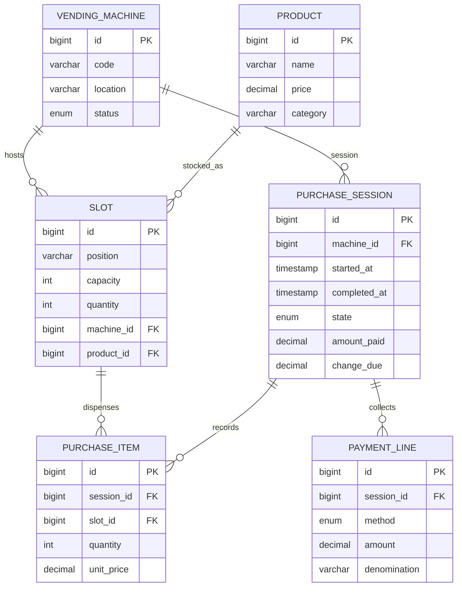

# Vending Machine – Spring Boot Edition

This module upgrades the original `vendingmachine` LLD into a production-ready Spring Boot REST service. It models machines, slots, products, denominations, and purchase sessions backed by H2 + JPA so you can simulate vending flows end-to-end.

## Domain Schema

## What’s Included
- Spring Boot 3, JPA, and H2 for an in-memory back end.
- REST APIs to view machine inventory, start a purchase, insert denominations, and dispense/refund.
- MapStruct records/DTOs plus validation.
- Sample data + HTTP scratch file for manual testing.
- Integration-style service test for the vending workflow.

## Getting Started
1. `cd solutions/java/springboot/vendingmachine`
2. `mvn spring-boot:run`
3. Try the APIs described in `requests.http` or hit `http://localhost:8080/h2-console` with `jdbc:h2:mem:vendingdb` to inspect data.

## REST Surface
- `GET /api/vending-machines` – inventory snapshot for every machine & slot.
- `POST /api/vending-machines/{code}/sessions` – select a slot + quantity to start a purchase session.
- `POST /api/vending-machines/{code}/sessions/{sessionId}/payments` – insert coins/notes/cards.
- `POST /api/vending-machines/{code}/sessions/{sessionId}/dispense` – finalize and decrement stock once paid.
- `POST /api/vending-machines/{code}/sessions/{sessionId}/refund` – abort and refund whatever was inserted.
- `GET /api/vending-machines/{code}/sessions/{sessionId}` – poll session status.

All requests use JSON body; DTOs live under `dto/`.

## Testing
`mvn test` executes `VendingMachineServiceTest`, which spins up the Spring context, seeds the in-memory database, and runs through a purchase + refund scenario end-to-end.
